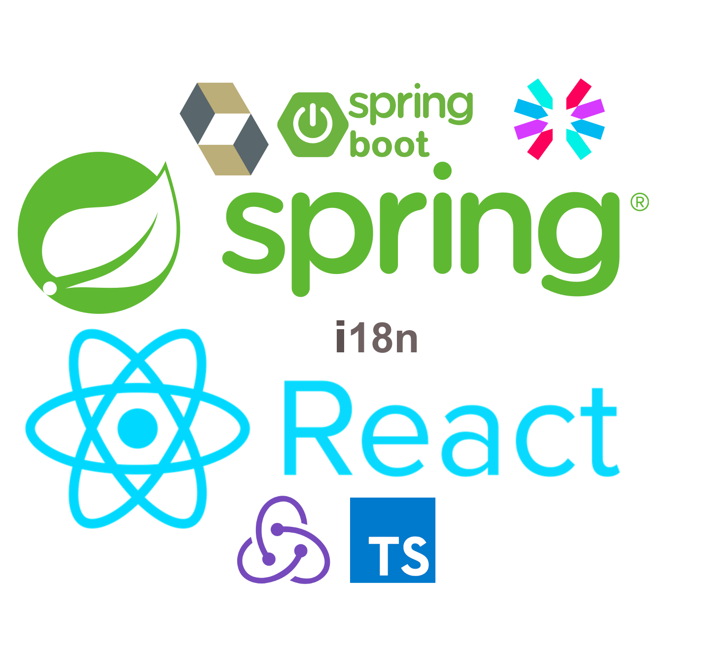
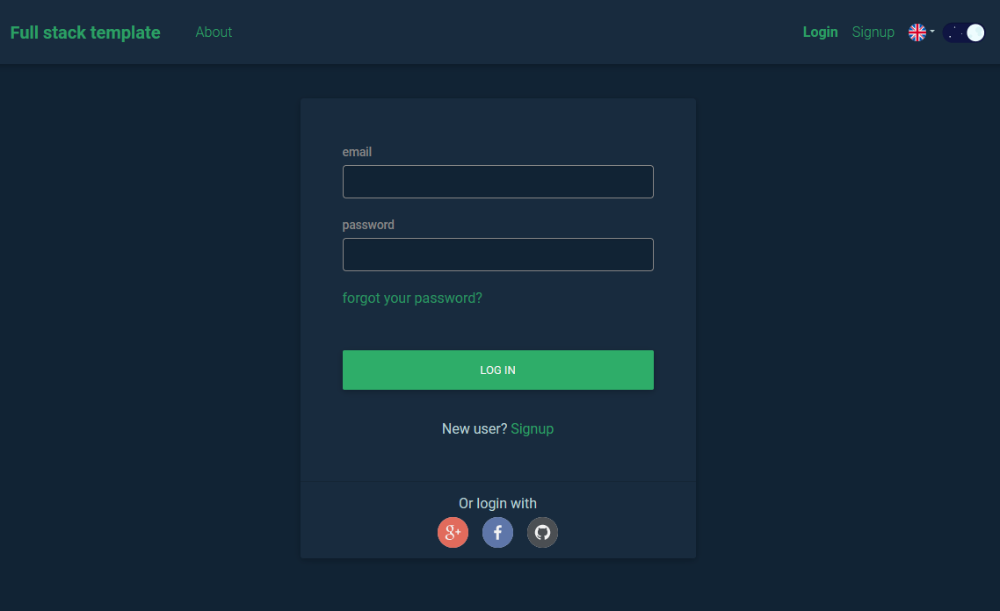

# Full stack template - React

<p align="center">
 
</p>


Full stack template is a **React/Spring** based template webapp that provides set of functionalities that are necessary for almost any web app. The code and all components were structured so that project is easy to test, maintain and expand.

This is a repository for the frontend part written in React.

Backend can be found [HERE](https://github.com/Hasatori/fullstack-boilerplate-spring-backend)

The template is running on the following url:  <a href="https://www.full-stack-template.com/" target="_blank">https://www.full-stack-template.com</a>


## Installation

1) Install yarh - `npm install --global yarn`
2) Install packages - `yarn install`
3) Run app - `npm start`

## Environment configuration

Application can be configured via .env files. Currently there are two configuration files:

* `.env` - configuration for production
* `.env.development` - configuration for **development** environment

There are of course more configuration files for other environments - detailed information can be found at [Create React App](https://create-react-app.dev/docs/adding-custom-environment-variables/#what-other-env-files-can-be-used)

## General supported functionalities
### User registration
  * username, email and password. Account has to be activated via email
  * O2 - Github, Google, Facebook
### User login
  * email + password
  * email + password + two-factor code. Two-factor can be set once user is logged in.
  * email + password + recovery code. In case two factor code can not be used.
  * O2 authentication - Github, Google, Facebook
  * O2 authentication + two-factor. Two-factor can be set once user is logged in
### Forgotten password 
   * Password change request is send on email
### Account management
  * profile picture, email, username update. If email is updated the change has to be approved from new email -
    otherwise email will not be updated
  * password change
  * cancel account

## React specific supported functionalities

### Typescript

App is written in Typescript. Configuration can be found at [./tsconfig.json](./tsconfig.json). Target version is for es5 and strict mode is enabled.

### Redux

App is fully integrated with [redux](https://redux.js.org). All stores, reducers and actions are in the [./src/redux](./src/redux). Store is configured to use [thunk](https://github.com/reduxjs/redux-thunk) that allows dispatching asynchronous actions. 

### Axios

App uses HTTP client [axios](https://www.npmjs.com/package/axios) for communication with backend. Configuration can be found at [./src/util/APIUtils.ts](./src/util/APIUtils.ts)

### Localization
  Localization was implemented using  [react-i18next](https://react.i18next.com/). 
  All localization related stuff are stored under [./src/i18n](./src/i18n). [I18nConfig.ts](./src/i18n/I18nConfig.ts) contains basic configuration. All translations for specific language are then stored in translation.json file that is in the folder named based on given locale. 
  Translations are then loaded using **useTranslation()** hook. 
  For example:
  ```
 const {t, i18n} = useTranslation();
  ....
 <div>t('ns1:aboutAppLabel')}</div>
```
The locale is also used for communication with backed which also supports localization so messages comming from backed will also be translated into correct language.

### Theme support
  App supports light and dark theme. Theme colors are set in [./src/index.scss](./src/index.scss). Toggler is part of the [AppHeader](./src/components/navigation/AppHeader.tsx) component and selected theme is set using redux. Main component [App](./src/App.tsx) then uses `useEffect` hook to change body class. Theme choice is also saved into a Cookie.

